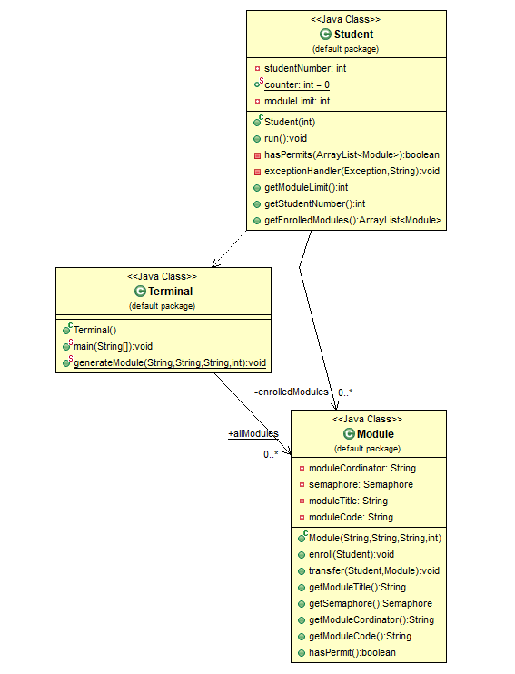

**This is a copy of the document located [here](./Documentation.pdf)**
**A mark of 100% was achieved in this coursework**

During this coursework I grappled with issues of concurrency, finally understanding the paradigms thoroughly upon completion of the coursework. This later heavily influenced the concurrency management of [SignWire](https://github.com/jramseygreen/SignWire).

## Class Diagram

# Joshua Green 956213 – CS210 Coursework ‘Documentation’ document

# Race Conditions

I have made module’s functions use the synchronized keyword to ensure that only one thread can execute the code within. This combined with a semaphore for each module where the number of permits available matches the module limit means that all the shared resources are correctly managed to avoid race conditions.

# Deadlock

# 1. Mutual Exclusion Condition

The modules are shared resources which become locked when the module limit is reached
through use of a semaphore. This means that the mutual exclusion condition is met as the
resources involved are non-shareable.

# 2. Hold and Wait Condition

If a module is full then the thread will generate a new random module and try again due to the fact that an available permit in the semaphore is equal to an available spot on the module. If a permit cannot be acquired, an Exception is always thrown and caught. When all shared resources are held, resource requests are no longer made. Therefore, threads no longer wait for any held resources; breaking the hold and wait condition.

# 3. No-Preemptive Condition

Only by a student making a successful transfer request can a module be released voluntarily by the thread. There is no way to pre-emtively release resources.

# 4. Circular Wait Condition

If a permit cannot be obtained, the student is already enrolled, or the student cannot enroll
anymore due to reaching their module limit, then the student will try the next module from the random number generator. It will not wait for resources cyclically.
